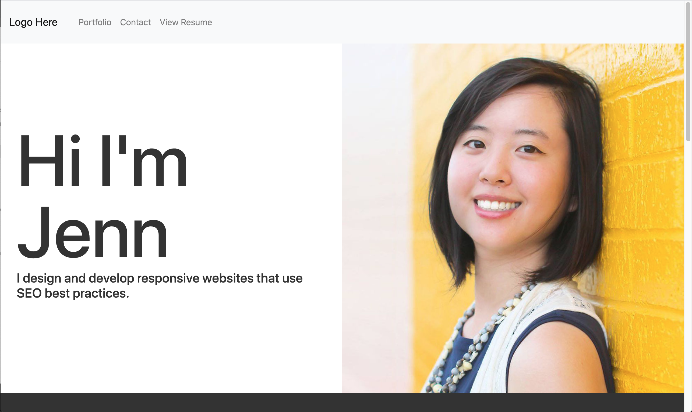

# Responsive Portfolio

Responsive design ensures that web applications render well on a variety of devices and window or screen sizes. A developer would be requested to create a mobile-first application or add responsive design to an existing application.

This website is a mobile-first design with a customized color palatte, with font sizes that are large enough to read, and colors don't cause eye strain.

View Website: https://jennifoo.github.io/Responsive-Portfolio/
 
Github Repository: https://github.com/jennifoo/Responsive-Portfolio

## Directions

The Bootstrap CSS Framework was used to create a mobile responsive portfolio. with the following guidelines:

* Create the following files files: `index.html`, `portfolio.html` and `contact.html`.

* Using Bootstrap, develop the portfolio site with the following items:

   * A navbar

   * A responsive layout

   * Responsive images

* The Bootstrap portfolio should minimize the use of media queries.

### Additional Information

* Used Bootstrap's grid system (containers, rows, and columns).

* On an `xs` screen, content takes up the entire screen. On `sm` and larger screens, there are  some margins on the left and right sides of the screen. 

* Used an HTML validation service to ensure that each page has valid HTML.

### Minimum Requirements

* Functional, deployed application

* GitHub repository with README describing the project

* Navbar must be consistent on each page.

* Navbar on each page must contain links to Home/About, Contact, and Portfolio pages.

* All links must work.

* Must use semantic html.

* Each page must have valid and correct HTML. (use a validation service)

* Must contain your personalized information. (bio, name, images, links to social media, etc.)

* Must properly utilize Bootstrap components and grid system.

### Bonus

* Using Bootstrap, make a sticky footer and use sub-rows and sub-columns on your portfolio site (**Hint:** Check out the Bootstrap documentation).
